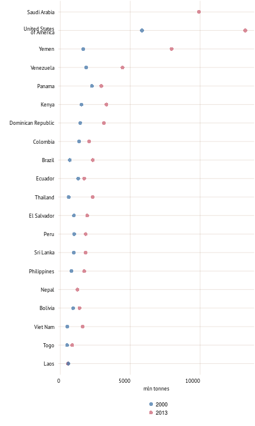
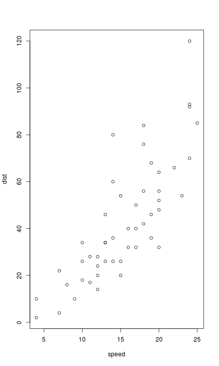
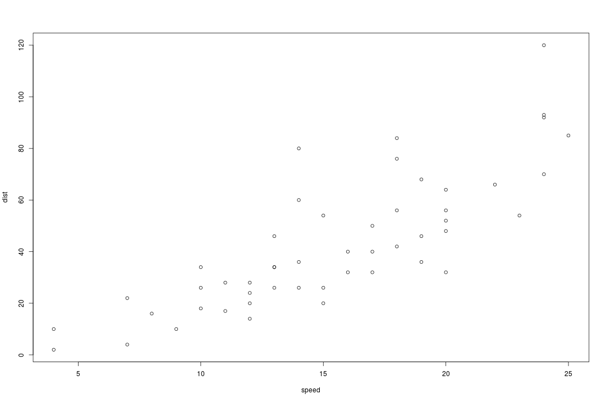

```r
knitr::read_chunk(paste0(root.dir,"input/code/code_part6.R"))
```


```r
source(paste0(root.dir,'./input/code/plot/plot_color.R'))

syb_part <- 6

## Part 4
colPart6 <- plot_colors(part = syb_part, 12)
col.main1 <- colPart6[["Main"]][1]
## color for the grid
col.main2 <- colPart6[["Main"]][2]

source(paste0(root.dir,"./input/code/plot/theme.R"))

# map functions
source(paste0(root.dir,'./input/code/plot/map_categories.R'))


# 
#    ____            __    __                                              _                  _     _                 
#   / ___|   ___    / _|  / _|   ___    ___     _ __    _ __    ___     __| |  _   _    ___  | |_  (_)   ___    _ __  
#  | |      / _ \  | |_  | |_   / _ \  / _ \   | '_ \  | '__|  / _ \   / _` | | | | |  / __| | __| | |  / _ \  | '_ \ 
#  | |___  | (_) | |  _| |  _| |  __/ |  __/   | |_) | | |    | (_) | | (_| | | |_| | | (__  | |_  | | | (_) | | | | |
#   \____|  \___/  |_|   |_|    \___|  \___|   | .__/  |_|     \___/   \__,_|  \__,_|  \___|  \__| |_|  \___/  |_| |_|
#                                              |_|                                                                    
# 
```


```r
spread_title <- "Coffee prices"
short_text <- " Lorem ipsum dolor sit amet, consectetur adipiscing elit. Phasellus egestas risus at lobortis lacinia. Mauris a nunc eleifend, sodales magna ut, congue arcu. Fusce in odio nunc. Mauris vehicula faucibus eros a blandit. Aenean ut tempus ipsum, eu faucibus lorem. Maecenas pretium nibh sit amet nulla accumsan, eu auctor massa facilisis. In malesuada nisl quis sem dapibus iaculis. Ut fermentum leo turpis, convallis luctus elit auctor sed. Quisque nec vestibulum augue. Praesent suscipit finibus tellus, ut semper quam fermentum luctus. "
```

<h1> Coffee prices </h1> 
<p> Lorem ipsum dolor sit amet, consectetur adipiscing elit. Phasellus egestas risus at lobortis lacinia. Mauris a nunc eleifend, sodales magna ut, congue arcu. Fusce in odio nunc. Mauris vehicula faucibus eros a blandit. Aenean ut tempus ipsum, eu faucibus lorem. Maecenas pretium nibh sit amet nulla accumsan, eu auctor massa facilisis. In malesuada nisl quis sem dapibus iaculis. Ut fermentum leo turpis, convallis luctus elit auctor sed. Quisque nec vestibulum augue. Praesent suscipit finibus tellus, ut semper quam fermentum luctus. </p> 


```r
# Producer prices, green coffee (US$ per tonne)
dat <- getFAOtoSYB(domainCode = "PP",
                   elementCode = 5532,
                   itemCode = 656)
PP_656_5532 <- dat$aggregates

# Producer price index (2004-06=100)
dat <- getFAOtoSYB(domainCode = "PP",
                   elementCode = 5539,
                   itemCode = 656)
PP_656_5539 <- dat$aggregates
```


```r
plot(cars)
```

 

```r
# Caption
caption_text <- "Countries with the lowest renewable water resources per capita"
```

</br> <p class='caption'>Countries with the lowest renewable water resources per capita</p>


```r
dat <- PP_656_5532[!is.na(PP_656_5532$PP_656_5532),]
# Add region key and subset
dat <- left_join(dat,region_key)

dat <- dat[dat$FAOST_CODE != 348,]
dat$SHORT_NAME[dat$FAOST_CODE == 351] <- "China"

dat <- dat[which(dat[[region_to_report]]),]

dat <- arrange(dat, -Year, -PP_656_5532)
top15 <- dat %>% slice(1:20) %>% mutate(color = "2013")
top91 <- dat %>% filter(FAOST_CODE %in% top15$FAOST_CODE, Year == 2000) %>% mutate(color = "2000")
dat_plot <- rbind(top15,top91)
# 
p <- ggplot(dat_plot, aes(x=reorder(SHORT_NAME, PP_656_5532),y=PP_656_5532))
p <- p + geom_point(aes(color=color),size = 3, alpha = 0.75)
p <- p + scale_color_manual(values=plot_colors(part = syb_part, 2)[["Sub"]])
p <- p + coord_flip()
p <- p + labs(x="",y="mln tonnes")
p <- p + guides(color = guide_legend(nrow = 2))
p
```

 

```r
# Caption
caption_text <- "Producer prices, green coffee (US\\$ per tonne) in 2013, Top 20 countries"
```

</br> <p class='caption'>Producer prices, green coffee (US\$ per tonne) in 2013, Top 20 countries</p>


```r
plot(cars)
```

 

```r
# Caption
caption_text <- "Freshwater withdrawal by agricultural sector, share of total, highest 20 (1999 to 2013)"
```

</br> <p class='caption'>Freshwater withdrawal by agricultural sector, share of total, highest 20 (1999 to 2013)</p>


```r
plot(cars)
```

 

```r
# Caption
caption_text <- "Countries with the lowest renewable water resources per capita"
```

</br> <p class='caption'>Countries with the lowest renewable water resources per capita</p>


```r
plot(cars)
```

 

```r
# Caption
caption_text <- "Freshwater resources withdrawn by agriculture (percent, 1999-2013*)"
```

</br> <p class='caption'>Freshwater resources withdrawn by agriculture (percent, 1999-2013*)</p>

