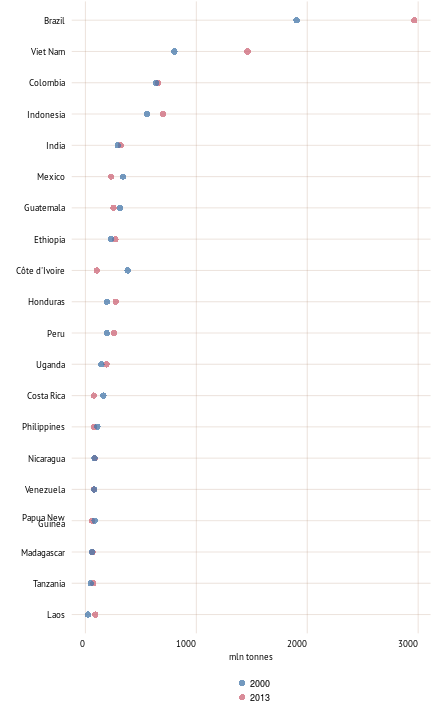
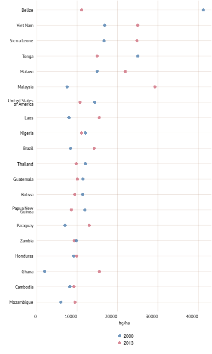
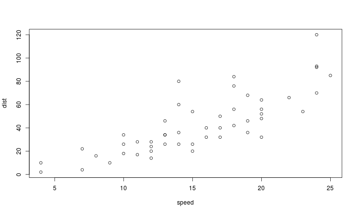
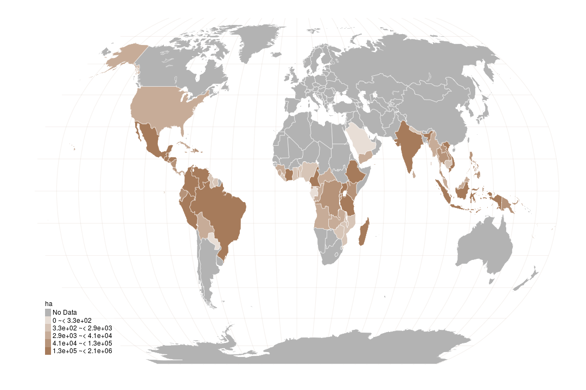

```r
knitr::read_chunk(paste0(root.dir,"input/code/code_part6.R"))
```


```r
source(paste0(root.dir,'./input/code/plot/plot_color.R'))

syb_part <- 6

## Part 4
colPart6 <- plot_colors(part = syb_part, 12)
col.main1 <- colPart6[["Main"]][1]
## color for the grid
col.main2 <- colPart6[["Main"]][2]

source(paste0(root.dir,"./input/code/plot/theme.R"))

# map functions
source(paste0(root.dir,'./input/code/plot/map_categories.R'))


# 
#    ____            __    __                                              _                  _     _                 
#   / ___|   ___    / _|  / _|   ___    ___     _ __    _ __    ___     __| |  _   _    ___  | |_  (_)   ___    _ __  
#  | |      / _ \  | |_  | |_   / _ \  / _ \   | '_ \  | '__|  / _ \   / _` | | | | |  / __| | __| | |  / _ \  | '_ \ 
#  | |___  | (_) | |  _| |  _| |  __/ |  __/   | |_) | | |    | (_) | | (_| | | |_| | | (__  | |_  | | | (_) | | | | |
#   \____|  \___/  |_|   |_|    \___|  \___|   | .__/  |_|     \___/   \__,_|  \__,_|  \___|  \__| |_|  \___/  |_| |_|
#                                              |_|                                                                    
# 
```


```r
spread_title <- "Coffee production"
short_text <- "Land is necessary for sustainable agricultural development, essential ecosystem functions and food security. More than 1.5 billion hectares – about 12 percent of the world’s land area – are used for crop production. Although large amounts of land are potentially suitable for agriculture, much of it is covered by forests, protected for environmental reasons or are part of urban areas. Some 90 percent of agricultural land is in Latin America and sub-Saharan Africa. At the other extreme, there is almost none available for agricultural expansion in Southern Asia, the Western Asia and Northern Africa."
```

<h1> Coffee production </h1> 
<p>Land is necessary for sustainable agricultural development, essential ecosystem functions and food security. More than 1.5 billion hectares – about 12 percent of the world’s land area – are used for crop production. Although large amounts of land are potentially suitable for agriculture, much of it is covered by forests, protected for environmental reasons or are part of urban areas. Some 90 percent of agricultural land is in Latin America and sub-Saharan Africa. At the other extreme, there is almost none available for agricultural expansion in Southern Asia, the Western Asia and Northern Africa.</p> 


```r
# Area harvested, coffee (ha)
dat <- getFAOtoSYB(domainCode = "QC",
                   elementCode = 5312,
                   itemCode = 656)
QC_656_5312 <- dat$aggregates

# Yield, coffee (hg/ha)
dat <- getFAOtoSYB(domainCode = "QC",
                   elementCode = 5419,
                   itemCode = 656)
QC_656_5419 <- dat$aggregates

# Production quantity, coffee (mln tonnes)
dat <- getFAOtoSYB(domainCode = "QC",
                   elementCode = 5510,
                   itemCode = 656)
QC_656_5510 <- dat$aggregates
```


```r
plot(cars)
```

 

```r
# Caption
caption_text <- "Countries with the lowest renewable water resources per capita"
```

</br> <p class='caption'>Countries with the lowest renewable water resources per capita</p>


```r
dat <- QC_656_5510[!is.na(QC_656_5510$QC_656_5510),]
# Add region key and subset
dat <- left_join(dat,region_key)

dat <- dat[dat$FAOST_CODE != 348,]
dat$SHORT_NAME[dat$FAOST_CODE == 351] <- "China"

dat <- dat[which(dat[[region_to_report]]),]

dat <- arrange(dat, -Year, -QC_656_5510) %>% mutate(QC_656_5510 = QC_656_5510/1000)
top15 <- dat %>% slice(1:20) %>% mutate(color = "2013")
top91 <- dat %>% filter(FAOST_CODE %in% top15$FAOST_CODE, Year == 2000) %>% mutate(color = "2000")
dat_plot <- rbind(top15,top91)
# 
p <- ggplot(dat_plot, aes(x=reorder(SHORT_NAME, QC_656_5510),y=QC_656_5510))
p <- p + geom_point(aes(color=color),size = 3, alpha = 0.75)
p <- p + scale_color_manual(values=plot_colors(part = syb_part, 2)[["Sub"]])
p <- p + coord_flip()
p <- p + labs(x="",y="mln tonnes")
p <- p + guides(color = guide_legend(nrow = 2))
p
```

 

```r
# Caption
caption_text <- "Countries with the highest coffee production quantities in 2013"
```

</br> <p class='caption'>Countries with the highest coffee production quantities in 2013</p>


```r
dat <- QC_656_5419[!is.na(QC_656_5419$QC_656_5419),]
# Add region key and subset
dat <- left_join(dat,region_key)

dat <- dat[dat$FAOST_CODE != 348,]
dat$SHORT_NAME[dat$FAOST_CODE == 351] <- "China"

dat <- dat[which(dat[[region_to_report]]),]

dat <- arrange(dat, -Year, -QC_656_5419)
top15 <- dat %>% slice(1:20) %>% mutate(color = "2013")
top91 <- dat %>% filter(FAOST_CODE %in% top15$FAOST_CODE, Year == 2000) %>% mutate(color = "2000")
dat_plot <- rbind(top15,top91)
# 
p <- ggplot(dat_plot, aes(x=reorder(SHORT_NAME, QC_656_5419),y=QC_656_5419))
p <- p + geom_point(aes(color=color),size = 3, alpha = 0.75)
p <- p + scale_color_manual(values=plot_colors(part = syb_part, 2)[["Sub"]])
p <- p + coord_flip()
p <- p + labs(x="",y="hg/ha")
p <- p + guides(color = guide_legend(nrow = 2))
p
```

 

```r
# Caption
caption_text <- "Countries with the highest coffee yield in 2013"
```

</br> <p class='caption'>Countries with the highest coffee yield in 2013</p>


```r
plot(cars)
```

 

```r
# Caption
caption_text <- "Countries with the lowest renewable water resources per capita"
```

</br> <p class='caption'>Countries with the lowest renewable water resources per capita</p>


```r
dat <- QC_656_5312 %>% filter(Year %in% 2013, FAOST_CODE < 5000)

map.plot <- full_join(dat,map.df)

# Add region key and subset

# map.plot <- map.plot[which(map.plot[[region_to_report]]),]

cat_data <- map.plot[!duplicated(map.plot[c("FAOST_CODE")]),c("FAOST_CODE","QC_656_5312")]
cat_data$value_cat <- categories(x=cat_data$QC_656_5312, n=5, method="jenks")

map.plot <- left_join(map.plot,cat_data[c("FAOST_CODE","value_cat")])

# define map unit
map_unit <- "ha"

# graticule
grat_robin <- spTransform(graticule, CRS("+proj=robin"))  # reproject graticule
gr_rob <- fortify(grat_robin)
# crop the grid
if (!(region_to_report %in% c("GLO","COF"))) {
  gr_rob <- gr_rob[gr_rob$lat >= min(map.plot$lat) & gr_rob$lat <= max(map.plot$lat),]
  gr_rob <- gr_rob[gr_rob$long >= min(map.plot$long) & gr_rob$long <= max(map.plot$long),]
} else gr_rob <- gr_rob

create_map_here()
```

 

```r
# Caption
caption_text <- "Area harvested, coffee (ha)"


#    ____            __    __                   _                        _        
#   / ___|   ___    / _|  / _|   ___    ___    | |_   _ __    __ _    __| |   ___ 
#  | |      / _ \  | |_  | |_   / _ \  / _ \   | __| | '__|  / _` |  / _` |  / _ \
#  | |___  | (_) | |  _| |  _| |  __/ |  __/   | |_  | |    | (_| | | (_| | |  __/
#   \____|  \___/  |_|   |_|    \___|  \___|    \__| |_|     \__,_|  \__,_|  \___|
#                                                                                 
```

</br> <p class='caption'>Area harvested, coffee (ha)</p>
