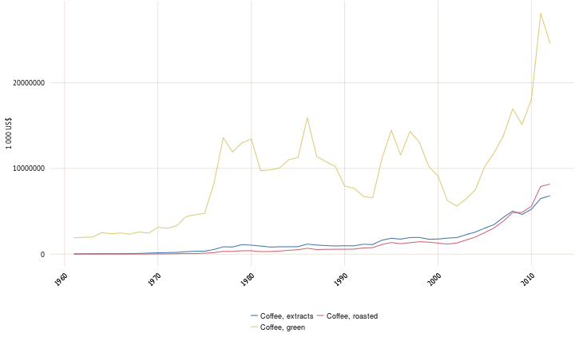
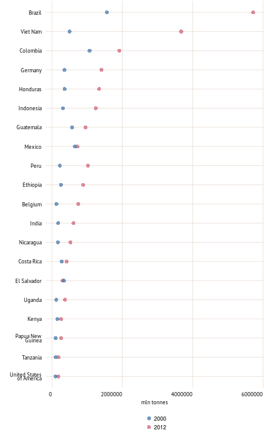
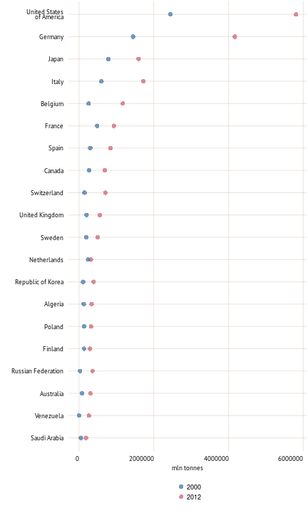
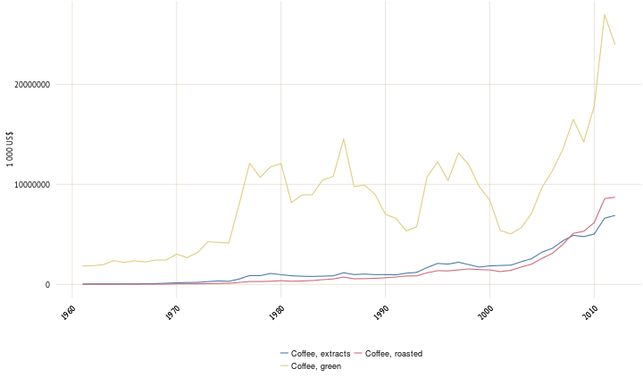
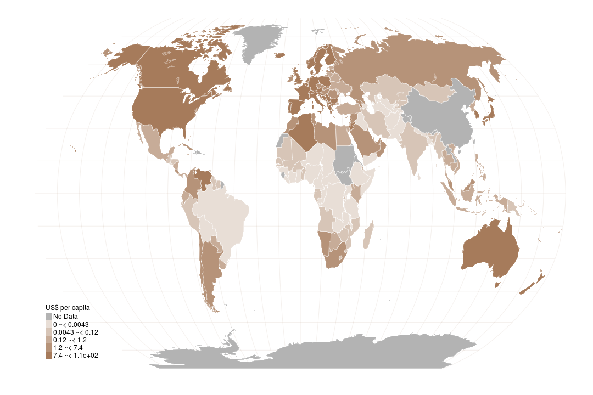

<h1> Coffee trade </h1> 

 Lorem ipsum dolor sit amet, consectetur adipiscing elit. Phasellus egestas risus at lobortis lacinia. Mauris a nunc eleifend, sodales magna ut, congue arcu. Fusce in odio nunc. Mauris vehicula faucibus eros a blandit. Aenean ut tempus ipsum, eu faucibus lorem. Maecenas pretium nibh sit amet nulla accumsan, eu auctor massa facilisis. In malesuada nisl quis sem dapibus iaculis. Ut fermentum leo turpis, convallis luctus elit auctor sed. Quisque nec vestibulum augue. Praesent suscipit finibus tellus, ut semper quam fermentum luctus. 
 

   
Imports of coffee

   
Top 20 coffee exporters in 2012

   
Top 20 coffee importers in 2012

   
Exports of coffee

   
Coffee imports in 2012

