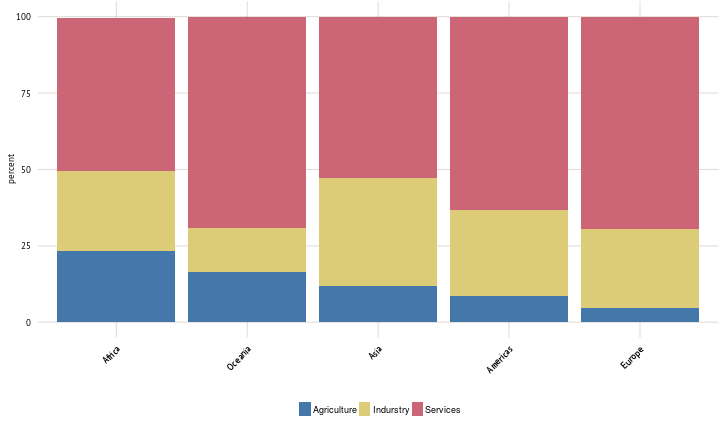
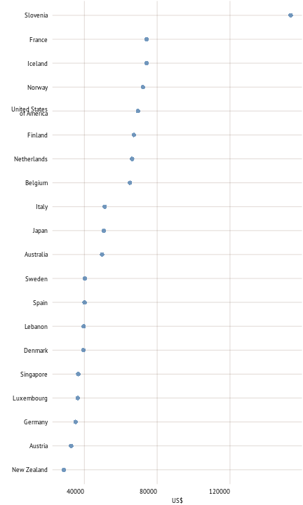
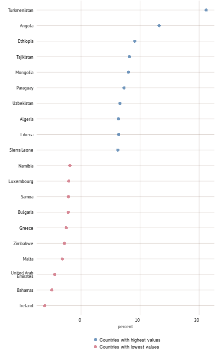
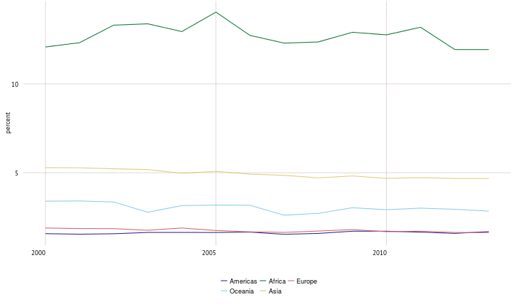
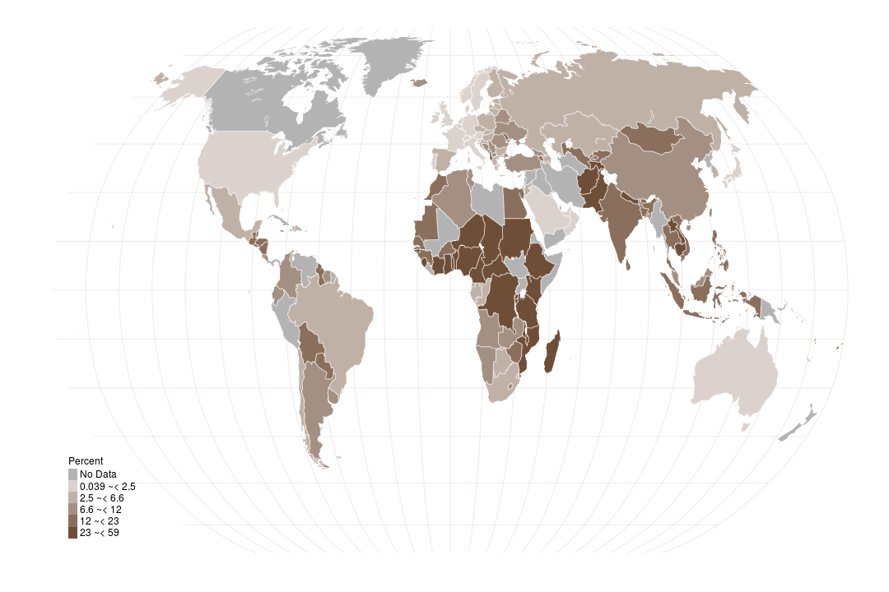

```r
knitr::read_chunk(paste0(root.dir,"input/code/code_part5.R"))
```


```r
source(paste0(root.dir,'./input/code/plot/plot_color.R'))

syb_part <- 5

## Part 5
colPart5 <- plot_colors(part = syb_part, 12)
col.main1 <- colPart5[["Main"]][1]
## color for the grid
col.main2 <- colPart5[["Main"]][2]

source(paste0(root.dir,"./input/code/plot/theme.R"))

# map functions
source(paste0(root.dir,'./input/code/plot/map_categories.R'))
 # --------------------------------------------------------------- #


#    ___                                  _                   
#   / _ \  __   __   ___   _ __  __   __ (_)   ___  __      __
#  | | | | \ \ / /  / _ \ | '__| \ \ / / | |  / _ \ \ \ /\ / /
#  | |_| |  \ V /  |  __/ | |     \ V /  | | |  __/  \ V  V / 
#   \___/    \_/    \___| |_|      \_/   |_|  \___|   \_/\_/  
#                                                            
```


```r
spread_title <- "Economy"
short_text <- "While some sectors have been hard hit, agriculture has demonstrated resilience during the recent economic downturn.  Changes in the wider economy, including growing global integration, affect the performance of the agriculture sector.  Higher overall economic growth also raises consumers’ incomes and hence food demand. Changing interest rates influence capital investments, land values and storage levels, while inflation affects input prices, revenues and credit costs. Fluctuations in exchange rates have an important bearing on international competitiveness and trade flows."
 # --------------------------------------------------------------- #
```

<h1> Economy </h1> 
<p>While some sectors have been hard hit, agriculture has demonstrated resilience during the recent economic downturn.  Changes in the wider economy, including growing global integration, affect the performance of the agriculture sector.  Higher overall economic growth also raises consumers’ incomes and hence food demand. Changing interest rates influence capital investments, land values and storage levels, while inflation affects input prices, revenues and credit costs. Fluctuations in exchange rates have an important bearing on international competitiveness and trade flows.</p> 


```r
dat <- filter(syb.df, Year %in% 2013) %>% select(FAOST_CODE,
                                                 NV.AGR.TOTL.ZS,
                                                 NV.IND.TOTL.ZS,
                                                 NV.SRV.TETC.ZS)

# Add region key and subset
dat <- left_join(dat,region_key)
dat <- dat[which(dat[[region_to_report]]),]

dat <- gather(dat, variable, value, 2:4)
dat$fill[dat$variable == "NV.AGR.TOTL.ZS"] <- "Agriculture"
dat$fill[dat$variable == "NV.IND.TOTL.ZS"] <- "Indurstry"
dat$fill[dat$variable == "NV.SRV.TETC.ZS"] <- "Services"


# DEFAULT GROUPING
df <- subgrouping(region_to_report = region_to_report)

# merge data with the region info
dat_plot <- merge(dat,df[c("FAOST_CODE","subgroup")],by="FAOST_CODE")

# AGREGATE
dat_plot <- dat_plot %>% group_by(subgroup,fill) %>% summarise(value  = mean(value, na.rm=TRUE)) %>% ungroup()

# reorder regions by the share of agricultural land
dat_plot$subgroup <- factor(dat_plot$subgroup,
                                  levels=arrange(dat_plot[dat_plot$fill == "Agriculture",],-value)$subgroup )

p <- ggplot(dat_plot, aes(x=subgroup, y=value, fill=fill))
p <- p + geom_bar(stat="identity", position="stack")
p <- p + scale_fill_manual(values=plot_colors(part = syb_part, 3)[["Sub"]])
p <- p + labs(x="",y="percent")
p <- p + theme(axis.text.x = element_text(angle=45))
p
```

 

```r
# Caption
caption_text <- "Value added in agriculture, industry and services, share of GDP (2013)"
```

</br> <p class='caption'>Value added in agriculture, industry and services, share of GDP (2013)</p>


```r
dat <- syb.df[syb.df$Year %in%  2013 & syb.df$FAOST_CODE < 5000,c("FAOST_CODE","Year","SHORT_NAME","EA.PRD.AGRI.KD")]

dat <- dat[!is.na(dat$EA.PRD.AGRI.KD),]
# Add region key and subset
dat <- left_join(dat,region_key)

dat <- dat[dat$FAOST_CODE != 348,]
dat$SHORT_NAME[dat$FAOST_CODE == 351] <- "China"

#and subset
dat <- dat[which(dat[[region_to_report]]),]

# top for this plot
dat <- arrange(dat, -EA.PRD.AGRI.KD)
dat_plot <- dat %>% slice(1:20) %>% mutate(color = "2013")

p <- ggplot(dat_plot, aes(x=reorder(SHORT_NAME, EA.PRD.AGRI.KD),y=EA.PRD.AGRI.KD))
p <- p + geom_point(aes(color=color),size = 3, alpha = 0.75)
p <- p + scale_color_manual(values=plot_colors(part = syb_part, 1)[["Sub"]])
p <- p + theme(legend.position = "none") # hide legend as only one year plotted
p <- p + coord_flip()
p <- p + labs(x="",y="US$")
p <- p + guides(color = guide_legend(nrow = 2))
p
```

 

```r
# Caption
caption_text <- "Agriculture value added per worker, countries with the highest values"
```

</br> <p class='caption'>Agriculture value added per worker, countries with the highest values</p>


```r
# data
dat <- syb.df %>% filter(Year %in% c(2003:2013)) %>% select(FAOST_CODE,SHORT_NAME,Year,NV.AGR.TOTL.KD)
dat <- dat[!is.na(dat$NV.AGR.TOTL.KD),]
dat <- dat[!is.na(dat$SHORT_NAME),]
# Add region key and subset
dat <- left_join(dat,region_key)
dat <- dat[which(dat[[region_to_report]]),]

top10 <- dat %>% arrange(FAOST_CODE,Year) %>%  
              group_by(FAOST_CODE) %>% dplyr::mutate(Growth=c(NA,exp(diff(log(NV.AGR.TOTL.KD)))-1)) %>% 
              #ddply("FAOST_CODE",transform,Growth=c(NA,exp(diff(log(NV.AGR.TOTL.KD)))-1)) %>% 
              group_by(SHORT_NAME) %>% 
              dplyr::summarise(growth_NV.AGR.TOTL.KD = mean(Growth, na.rm = TRUE)*100) %>% 
              arrange(-growth_NV.AGR.TOTL.KD) %>% 
              slice(1:10) %>% 
              mutate(color = "Countries with highest values")

bot10 <- dat %>% arrange(FAOST_CODE,Year) %>%  
              group_by(FAOST_CODE) %>% dplyr::mutate(Growth=c(NA,exp(diff(log(NV.AGR.TOTL.KD)))-1)) %>% 
              group_by(SHORT_NAME) %>% 
              dplyr::summarise(growth_NV.AGR.TOTL.KD = mean(Growth, na.rm = TRUE)*100) %>% 
              arrange(growth_NV.AGR.TOTL.KD) %>% 
              slice(1:10) %>% 
              mutate(color = "Countries with lowest values")
dat_plot <- rbind(top10,bot10)
  
p <- ggplot(dat_plot, aes(x=reorder(SHORT_NAME, growth_NV.AGR.TOTL.KD),y=growth_NV.AGR.TOTL.KD))
p <- p + geom_point(aes(color=color),size = 3, alpha = 0.75)
p <- p + scale_color_manual(values=plot_colors(part = syb_part, 2)[["Sub"]])
p <- p + coord_flip()
p <- p + labs(x="",y="percent")
p <- p + guides(color = guide_legend(nrow = 2))
p
```

 

```r
# Caption
caption_text <- "Life expectancy at birth, countries with the highest and lowest values (2013)"
#if (region_to_report == "COF") dat <- dat[dat$FAOST_CODE == 5000,]

 # --------------------------------------------------------------- #
```

</br> <p class='caption'>Life expectancy at birth, countries with the highest and lowest values (2013)</p>


```r
# data
# Constant GDP from World Bank
library(WDI)
dl <- WDI(indicator = c("NY.GDP.MKTP.KD","iso3Code"), start=2000, end=2013)
names(dl)[names(dl)=="year"] <- "Year"
dl <- merge(dl,FAOcountryProfile[c("ISO2_WB_CODE","FAOST_CODE","UNSD_MACRO_REG_CODE","UNSD_SUB_REG_CODE")],
            by.x="iso2c",by.y="ISO2_WB_CODE",all.x=TRUE)
dl <- na.omit(dl)

# nominator from syb FAOSTAT
nomin <- syb.df[c("FAOST_CODE","SHORT_NAME","Year","NV.AGR.TOTL.KD")]
 # --------------------------------------------------------------- #
```


```r
# DEFAULT GROUPING
df <- subgrouping(region_to_report = region_to_report)

# merge data with the region info
dat <- merge(dl,df[c("FAOST_CODE","subgroup")],by="FAOST_CODE")

#dat_plot <- dat %>% group_by(subgroup,Year) %>% dplyr::summarise(constant_gdp = sum(NY.GDP.MKTP.KD,na.rm=TRUE))

dat <- merge(nomin,dat,by=c("FAOST_CODE","Year"))

dat_plot <- dat %>%  group_by(subgroup,Year) %>% 
    summarise(constant_gdp    = sum(NY.GDP.MKTP.KD,na.rm=TRUE),
              agr_value_added = sum(NV.AGR.TOTL.KD,na.rm=TRUE)) %>% 
    mutate(share = agr_value_added/constant_gdp*100) %>% 
    ungroup() %>%  
    arrange(-share)

p <- ggplot(data = dat_plot, aes(x = Year, y = share,group=subgroup,color=subgroup))
p <- p + geom_line()
p <- p + scale_color_manual(values = plot_colors(part = 1, length(unique(dat_plot$subgroup)))[["Sub"]])
p <- p + labs(y="percent", x="")
p <- p + guides(color = guide_legend(nrow = 2))
p
```

 

```r
# Caption
caption_text <- "Value added in agriculture as share of GDP"
 # --------------------------------------------------------------- #
```

</br> <p class='caption'>Value added in agriculture as share of GDP</p>


```r
dat <- syb.df %>% filter(Year %in% c(2010:2013), FAOST_CODE < 5000) %>%
                select(FAOST_CODE,SHORT_NAME,NV.AGR.TOTL.ZS) %>%
                group_by(FAOST_CODE) %>% dplyr::summarise(NV.AGR.TOTL.ZS = max(NV.AGR.TOTL.ZS)) %>% 
                ungroup()

map.plot <- left_join(dat,map.df)

# Add region key and subset
# map.plot <- map.plot[which(map.plot[[region_to_report]]),]

cat_data <- map.plot[!duplicated(map.plot[c("FAOST_CODE")]),c("FAOST_CODE","NV.AGR.TOTL.ZS")]
cat_data$value_cat <- categories(x=cat_data$NV.AGR.TOTL.ZS, n=5, method="jenks")

map.plot <- left_join(map.plot,cat_data[c("FAOST_CODE","value_cat")])

# define map unit
map_unit <- "Percent"

# graticule
grat_robin <- spTransform(graticule, CRS("+proj=robin"))  # reproject graticule
gr_rob <- fortify(grat_robin)
# crop the grid
if (!(region_to_report %in% c("GLO","COF"))) {
  gr_rob <- gr_rob[gr_rob$lat >= min(map.plot$lat) & gr_rob$lat <= max(map.plot$lat),]
  gr_rob <- gr_rob[gr_rob$long >= min(map.plot$long) & gr_rob$long <= max(map.plot$long),]
} else gr_rob <- gr_rob

create_map_here()
```

 

```r
# Caption
caption_text <- "Value added in agriculture, share of GDP (percent, 2010 to 2013*)"
 # --------------------------------------------------------------- #


# 
#   ____                                  _           
#  |  _ \    ___   __   __   ___   _ __  | |_   _   _ 
#  | |_) |  / _ \  \ \ / /  / _ \ | '__| | __| | | | |
#  |  __/  | (_) |  \ V /  |  __/ | |    | |_  | |_| |
#  |_|      \___/    \_/    \___| |_|     \__|  \__, |
#                                               |___/ 
```

</br> <p class='caption'>Value added in agriculture, share of GDP (percent, 2010 to 2013*)</p>
