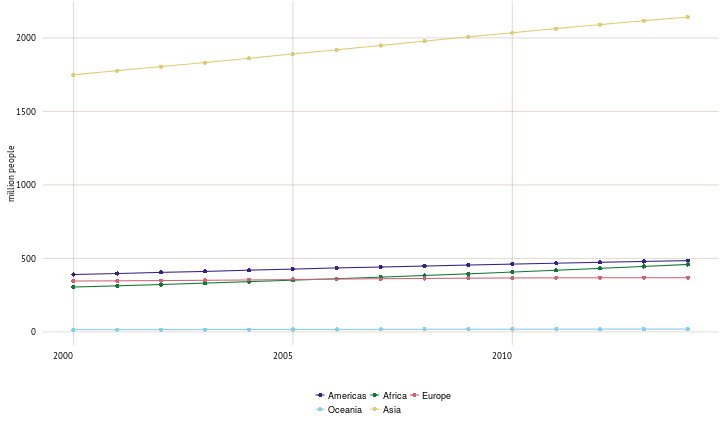

<!--
#    ___                                  _                   
#   / _ \  __   __   ___   _ __  __   __ (_)   ___  __      __
#  | | | | \ \ / /  / _ \ | '__| \ \ / / | |  / _ \ \ \ /\ / /
#  | |_| |  \ V /  |  __/ | |     \ V /  | | |  __/  \ V  V / 
#   \___/    \_/    \___| |_|      \_/   |_|  \___|   \_/\_/  
#                                                            
-->

<h1> Overview </h1> 

A combination of declining mortality rates, prolonged life expectancy and younger populations in regions with high fertility contributes to population growth in the world. While growth rates have been slowing since the late 1960s, the world’s population has nevertheless doubled since then, to over 7 billion people. Population growth is generally highest where income levels are low. This is especially true in cities. Since 2008, there have been more people living in cities than in rural areas.
 

   
rural and urban population

   
Population, average annual growth (2004-2014)

   
Life expectancy at birth, countries with the highest and lowest values (2013)

   
Total economically active population (2000 to 2014)

   
Rural population, share of total population (2014)

[jekyll-gh]: https://github.com/jekyll/jekyll
[jekyll]:    http://jekyllrb.com
