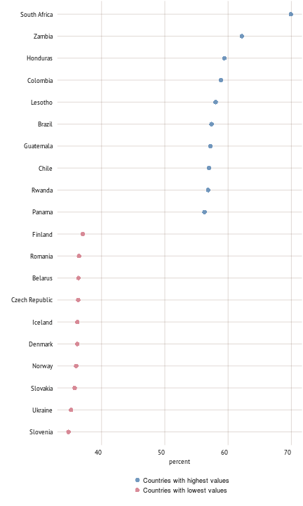
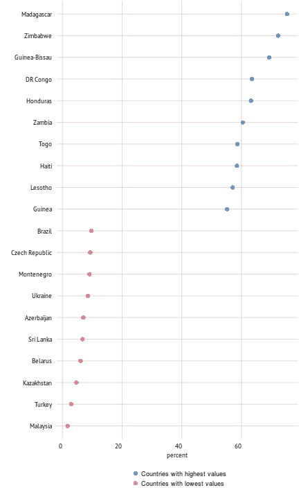
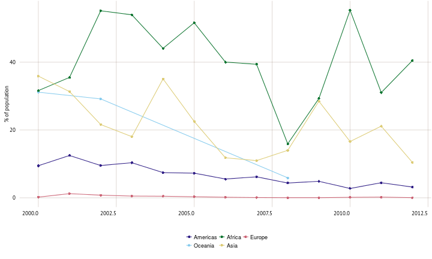
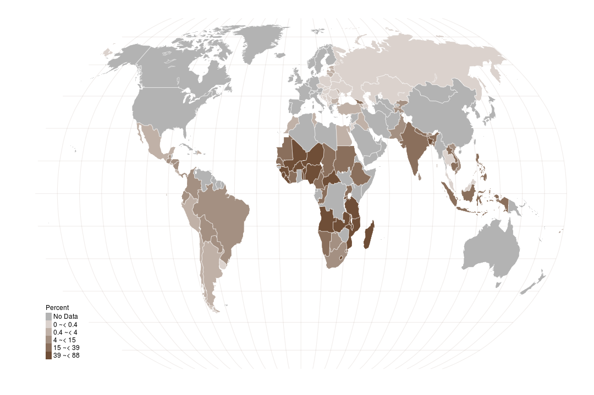

```r
knitr::read_chunk(paste0(root.dir,"input/code/code_part5.R"))
```


```r
source(paste0(root.dir,'./input/code/plot/plot_color.R'))

syb_part <- 5

## Part 5
colPart5 <- plot_colors(part = syb_part, 12)
col.main1 <- colPart5[["Main"]][1]
## color for the grid
col.main2 <- colPart5[["Main"]][2]

source(paste0(root.dir,"./input/code/plot/theme.R"))

# map functions
source(paste0(root.dir,'./input/code/plot/map_categories.R'))
 # --------------------------------------------------------------- #


#    ___                                  _                   
#   / _ \  __   __   ___   _ __  __   __ (_)   ___  __      __
#  | | | | \ \ / /  / _ \ | '__| \ \ / / | |  / _ \ \ \ /\ / /
#  | |_| |  \ V /  |  __/ | |     \ V /  | | |  __/  \ V  V / 
#   \___/    \_/    \___| |_|      \_/   |_|  \___|   \_/\_/  
#                                                            
```


```r
spread_title <- "Poverty"
short_text <- " Lorem ipsum dolor sit amet, consectetur adipiscing elit. Phasellus egestas risus at lobortis lacinia. Mauris a nunc eleifend, sodales magna ut, congue arcu. Fusce in odio nunc. Mauris vehicula faucibus eros a blandit. Aenean ut tempus ipsum, eu faucibus lorem. Maecenas pretium nibh sit amet nulla accumsan, eu auctor massa facilisis. In malesuada nisl quis sem dapibus iaculis. Ut fermentum leo turpis, convallis luctus elit auctor sed. Quisque nec vestibulum augue. Praesent suscipit finibus tellus, ut semper quam fermentum luctus. "
 # --------------------------------------------------------------- #
```

<h1> Poverty </h1> 
<p> Lorem ipsum dolor sit amet, consectetur adipiscing elit. Phasellus egestas risus at lobortis lacinia. Mauris a nunc eleifend, sodales magna ut, congue arcu. Fusce in odio nunc. Mauris vehicula faucibus eros a blandit. Aenean ut tempus ipsum, eu faucibus lorem. Maecenas pretium nibh sit amet nulla accumsan, eu auctor massa facilisis. In malesuada nisl quis sem dapibus iaculis. Ut fermentum leo turpis, convallis luctus elit auctor sed. Quisque nec vestibulum augue. Praesent suscipit finibus tellus, ut semper quam fermentum luctus. </p> 


```r
 # --------------------------------------------------------------- #
```


```r
dat <- filter(syb.df, Year %in%
                   c(1999:2014)) %>% 
                    group_by(FAOST_CODE,SHORT_NAME) %>% 
                    select(FAOST_CODE,Year,SI.POV.DDAY,OA.TPBS.POP.PPL.NO) %>% 
                    mutate(no_of_poor = OA.TPBS.POP.PPL.NO * (SI.POV.DDAY/100))

dat <- dat[!is.na(dat$no_of_poor),]
# Add region key and subset

# DEFAULT GROUPING
df <- subgrouping(region_to_report = region_to_report)

# merge data with the region info
dat <- merge(dat,df[c("FAOST_CODE","subgroup")],by="FAOST_CODE")

dat_2000 <- dat %>% group_by(subgroup) %>% 
  filter(Year %in% 1999:2001) %>% 
  summarise(no_of_poor = sum(no_of_poor, na.rm=TRUE)/1000000) %>% 
  mutate(no_of_poor = round(no_of_poor,0)) %>% 
  ungroup()

dat_2010 <- dat %>% group_by(subgroup) %>% 
  filter(Year %in% 2009:2011) %>% 
  summarise(no_of_poor = sum(no_of_poor, na.rm=TRUE)/1000000) %>% 
  mutate(no_of_poor = round(no_of_poor,0)) %>% 
  ungroup()

dw <- merge(dat_2000,dat_2010,by="subgroup")

names(dw) <- c("","1999-2001","2009-2011")

# dw <- head(cars)
# dw$names <- "hahahaha"

print.xtable(xtable(dw, caption = " Population living on less than US 1.25 a day", digits = c(0,0,0,0),
                    align= "l{\raggedright\arraybackslash}p{1.7cm}rr"),
             type = "latex", table.placement = NULL, 
             booktabs = TRUE, include.rownames = FALSE, size = "footnotesize", caption.placement = "top")

 # --------------------------------------------------------------- #
```

</br> <p class='caption'>Value added in agriculture, share of GDP (percent, 2010 to 2013*)</p>


```r
kable(dw)
```


|         | 1999-2001| 2009-2011|
|:--------|---------:|---------:|
|Africa   |       148|       270|
|Americas |       111|        46|
|Asia     |       263|       885|
|Europe   |        10|         1|


```r
dat <- filter(syb.df, Year %in%
                   c(2010:2014)) %>% 
                  group_by(FAOST_CODE,SHORT_NAME) %>% 
                  dplyr::summarise(SI.DST.05TH.20 = mean(SI.DST.05TH.20, na.rm=TRUE))
dat <- ungroup(dat)
dat <- dat[!is.na(dat$SI.DST.05TH.20),]
# Add region key and subset
dat <- left_join(dat,region_key)

dat <- dat[which(dat[[region_to_report]]),]

dat <- arrange(dat, -SI.DST.05TH.20)
top10 <- dat %>% slice(1:10) %>% mutate(color = "Countries with highest values")
bot10 <- dat %>% slice( (nrow(dat)-9):nrow(dat)) %>% mutate(color = "Countries with lowest values")
dat_plot <- rbind(top10,bot10)

p <- ggplot(dat_plot, aes(x=reorder(SHORT_NAME, SI.DST.05TH.20),y=SI.DST.05TH.20))
p <- p + geom_point(aes(color=color),size = 3, alpha = 0.75)
p <- p + scale_color_manual(values=plot_colors(part = syb_part, 2)[["Sub"]])
p <- p + coord_flip()
p <- p + labs(x="",y="percent")
p <- p + guides(color = guide_legend(nrow = 2))
p
```

 

```r
# Caption
caption_text <- "Income share held by highest 20 (percent) (2010-2014)"
 # --------------------------------------------------------------- #
```

</br> <p class='caption'>Income share held by highest 20 (percent) (2010-2014)</p>


```r
dat <- filter(syb.df, Year %in%
                   c(2010:2014)) %>% 
                  group_by(FAOST_CODE,SHORT_NAME) %>% 
                  dplyr::summarise(SI.POV.NAHC = mean(SI.POV.NAHC, na.rm=TRUE))
dat <- ungroup(dat)
dat <- dat[!is.na(dat$SI.POV.NAHC),]
# Add region key and subset
dat <- left_join(dat,region_key)

dat <- dat[which(dat[[region_to_report]]),]

dat <- arrange(dat, -SI.POV.NAHC)
top10 <- dat %>% slice(1:10) %>% mutate(color = "Countries with highest values")
bot10 <- dat %>% slice( (nrow(dat)-9):nrow(dat)) %>% mutate(color = "Countries with lowest values")
dat_plot <- rbind(top10,bot10)

p <- ggplot(dat_plot, aes(x=reorder(SHORT_NAME, SI.POV.NAHC),y=SI.POV.NAHC))
p <- p + geom_point(aes(color=color),size = 3, alpha = 0.75)
p <- p + scale_color_manual(values=plot_colors(part = syb_part, 2)[["Sub"]])
p <- p + coord_flip()
p <- p + labs(x="",y="percent")
p <- p + guides(color = guide_legend(nrow = 2))
p
```

 

```r
# Caption
caption_text <- "Poverty headcount ratio at national poverty line (population share)"
 # --------------------------------------------------------------- #
```

</br> <p class='caption'>Poverty headcount ratio at national poverty line (population share)</p>


```r
dat <- syb.df %>% filter(Year %in% c(2000:2014)) %>% 
  select(FAOST_CODE,Year,SHORT_NAME,SI.POV.DDAY,OA.TPBS.POP.PPL.NO)
dat <- dat[!is.na(dat$SI.POV.DDAY),]
dat <- dat[!is.na(dat$OA.TPBS.POP.PPL.NO),]
dat <- dat[!is.na(dat$SHORT_NAME),]


# DEFAULT GROUPING
df <- subgrouping(region_to_report = region_to_report)

# merge data with the region info
dat <- merge(dat,df[c("FAOST_CODE","subgroup")],by="FAOST_CODE")

# AGREGATE
dat_plot <- dat %>% group_by(subgroup,Year) %>% summarise(value = weighted.mean(SI.POV.DDAY, OA.TPBS.POP.PPL.NO, na.rm=TRUE)) %>% ungroup()

p <- ggplot(dat_plot, aes(x=Year,y=value,color=subgroup))
p <- p + geom_point() + geom_line()
p <- p + scale_color_manual(values=plot_colors(part = syb_part, length(unique(dat_plot$subgroup)))[["Sub"]])
p <- p + labs(x="",y="% of population")
p <- p + guides(color = guide_legend(nrow = 2))
p
```

 

```r
# Caption
caption_text <- "Share on population living less than US\\$ 1.25 per day"


 # --------------------------------------------------------------- #
```

</br> <p class='caption'>Share on population living less than US\$ 1.25 per day</p>


```r
dat <- syb.df %>% filter(Year %in% 2007:2012, FAOST_CODE < 5000) %>%
                  select(FAOST_CODE,SHORT_NAME,SI.POV.DDAY) %>% 
                  group_by(FAOST_CODE) %>% 
                  summarise(SI.POV.DDAY = mean(SI.POV.DDAY, na.rm=TRUE)) 

map.plot <- left_join(dat,map.df)

# Add region key and subset
# map.plot <- map.plot[which(map.plot[[region_to_report]]),]

cat_data <- map.plot[!duplicated(map.plot[c("FAOST_CODE")]),c("FAOST_CODE","SI.POV.DDAY")]
cat_data$value_cat <- categories(x=cat_data$SI.POV.DDAY, n=5, method="jenks")

map.plot <- left_join(map.plot,cat_data[c("FAOST_CODE","value_cat")])

# define map unit
map_unit <- "Percent"

# graticule
grat_robin <- spTransform(graticule, CRS("+proj=robin"))  # reproject graticule
gr_rob <- fortify(grat_robin)
# crop the grid
if (!(region_to_report %in% c("GLO","COF"))) {
  gr_rob <- gr_rob[gr_rob$lat >= min(map.plot$lat) & gr_rob$lat <= max(map.plot$lat),]
  gr_rob <- gr_rob[gr_rob$long >= min(map.plot$long) & gr_rob$long <= max(map.plot$long),]
} else gr_rob <- gr_rob

create_map_here()
```

 

```r
# Caption
caption_text <- "Share of population living less than US\\$ 1.25 per day (2007 - 2012)"

 # --------------------------------------------------------------- #


#   ____   _        _                                                                                         _        
#  |  _ \ (_)  ___ | |_  __ _  _ __  _   _    ___  _ __    ___  _ __  __ _  _   _   ___  _   _  _ __   _ __  | | _   _ 
#  | | | || | / _ \| __|/ _` || '__|| | | |  / _ \| '_ \  / _ \| '__|/ _` || | | | / __|| | | || '_ \ | '_ \ | || | | |
#  | |_| || ||  __/| |_| (_| || |   | |_| | |  __/| | | ||  __/| |  | (_| || |_| | \__ \| |_| || |_) || |_) || || |_| |
#  |____/ |_| \___| \__|\__,_||_|    \__, |  \___||_| |_| \___||_|   \__, | \__, | |___/ \__,_|| .__/ | .__/ |_| \__, |
#                                    |___/                           |___/  |___/              |_|    |_|        |___/ 
```

</br> <p class='caption'>Share of population living less than US\$ 1.25 per day (2007 - 2012)</p>
